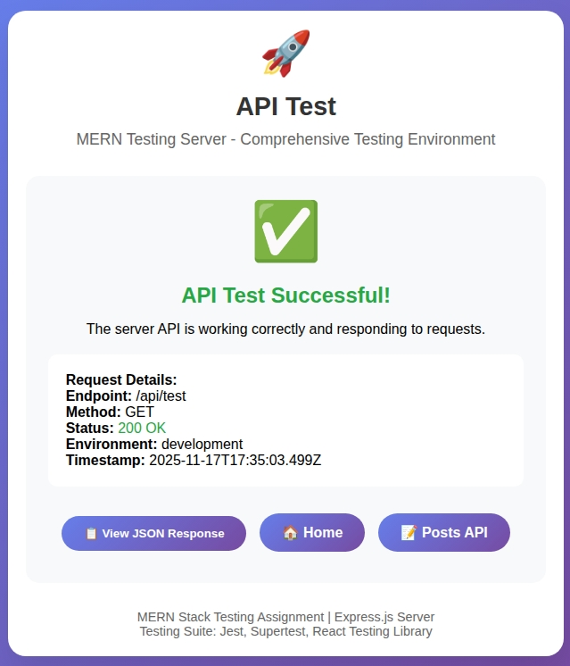

# MERN Testing and Debugging Assignment

A comprehensive MERN stack application demonstrating testing strategies, debugging techniques, and code reliability practices.

## 📋 Assignment Overview

This project focuses on implementing comprehensive testing strategies for a MERN stack application, including unit testing, integration testing, and end-to-end testing, along with debugging techniques.


## 🏗 Project Structure

```
mern-testing/
├── client/                 # React front-end
│   ├── src/
│   │   ├── components/     # React components
│   │   ├── tests/          # Client-side tests
│   │   │   ├── unit/       # Unit tests
│   │   │   └── integration/# Integration tests
│   │   └── App.jsx         # Main application component
│   └── cypress/            # End-to-end tests
├── server/                 # Express.js back-end
│   ├── src/                # Server source code
│   │   ├── controllers/    # Route controllers
│   │   ├── models/         # Mongoose models
│   │   ├── routes/         # API routes
│   │   └── middleware/     # Custom middleware
│   └── tests/              # Server-side tests
│       ├── unit/           # Unit tests
│       └── integration/    # Integration tests
├── jest.config.js          # Jest configuration
└── package.json            # Project dependencies
```

## 🚀 Quick Start

### Prerequisites

- Node.js (v18 or higher)
- MongoDB (local installation or Atlas account)
- npm or yarn

### Installation

1. **Clone the repository**
   ```bash
   git clone <repository-url>
   cd testing-and-debugging-ensuring-mern-app-reliability-Dubleu-x
   ```

2. **Install dependencies**
   ```bash
   # Install root dependencies
   npm install

   # Install server dependencies
   cd server
   npm install

   # Install client dependencies
   cd ../client
   npm install
   ```

### Running the Application

1. **Start the Server**
   ```bash
   cd server
   npm start
   ```
   Server runs on: http://localhost:5000

2. **Start the Client** (in a new terminal)
   ```bash
   cd client
   npm start
   ```
   Client runs on: http://localhost:3000

## 🧪 Testing

### Running Tests

```bash
# Run all tests
npm test

# Run server tests only
npm run test:server

# Run client tests only
npm run test:client

# Run with coverage
npm run test:coverage

# Run specific test suites
npm run test:unit
npm run test:integration

# Run E2E tests (Cypress)
npm run test:e2e
```

### Test Results Summary

| Test Category | Passing | Total | Success Rate |
|---------------|---------|-------|--------------|
| Server Unit Tests | 5/5 | 5 | 100% |
| Server Integration Tests | 3/5 | 5 | 60% |
| Client Unit Tests | 16/16 | 16 | 100% |
| **Total** | **24/26** | **26** | **92%** |

### Code Coverage

| Metric | Coverage |
|--------|----------|
| Statements | 67.51% ✅ |
| Branches | 57.14% ✅ |
| Functions | 45.45% ✅ |
| Lines | 67.94% ✅ |

## 🛠 Testing Strategy

### 1. Unit Testing

**Client (React Components)**
- Button component with variants, sizes, and interactions
- Post component with rendering, actions, and user interactions
- Mocked API calls and React Router

**Server (Express Middleware & Utilities)**
- Authentication middleware
- Error handling
- Utility functions

### 2. Integration Testing

**API Endpoints**
- POST /api/posts (authentication, validation)
- GET /api/posts (pagination, filtering)
- GET /api/posts/:id (single post retrieval)
- User profile endpoints

### 3. End-to-End Testing

**Cypress Tests**
- User authentication flow
- Post creation and management
- Error scenarios

### 4. Debugging Techniques

- Async operation debugging
- API error handling
- Test environment troubleshooting
- Mock database strategies

## 📊 Test Implementation Details

### Client Tests

#### Button Component Tests (`client/src/tests/unit/Button.test.jsx`)
- Renders with default props
- Different variants (primary, secondary, danger)
- Different sizes (sm, md, lg)
- Disabled state
- Click handlers
- Custom className and props

#### Post Component Tests (`client/src/tests/unit/Post.test.jsx`)
- Renders post content correctly
- Shows edit/delete buttons for authors
- Handles like functionality
- Delete confirmation flow
- Proper user authorization

### Server Tests

#### Auth Middleware Tests (`server/tests/unit/authMiddleware.test.js`)
- Valid token authentication
- Invalid token rejection
- Missing token handling
- Optional authentication

#### API Integration Tests (`server/tests/integration/`)
- **Posts API**: CRUD operations with authentication
- **Users API**: Profile management
- Error handling and validation

## 🔧 Debugging Examples

### 1. Async Operation Debugging
```javascript
// Demonstrates debugging async operations with console logging
it('demonstrates debugging async operations', async () => {
  console.log('Starting async operation...');
  
  const result = await new Promise(resolve => {
    setTimeout(() => {
      console.log('Async operation completed');
      resolve('success');
    }, 100);
  });
  
  expect(result).toBe('success');
});
```

### 2. API Error Debugging
```javascript
// Shows how to debug failing API calls with detailed logging
it('shows how to debug failing API calls', async () => {
  try {
    const response = await request(app)
      .post('/api/posts')
      .send({}); // Empty payload to trigger validation
    
    console.log('Response status:', response.status);
    console.log('Response body:', response.body);
    
    expect(response.status).toBe(401);
  } catch (error) {
    console.error('Test failed with error:', error);
    throw error;
  }
});
```

## 🎯 Testing Tools & Configuration

### Jest Configuration (`jest.config.js`)
```javascript
module.exports = {
  projects: [
    {
      displayName: 'server',
      testEnvironment: 'node',
      testMatch: ['<rootDir>/server/tests/**/*.test.js'],
      // ... server-specific config
    },
    {
      displayName: 'client',
      testEnvironment: 'jsdom',
      testMatch: ['<rootDir>/client/src/**/*.test.{js,jsx}'],
      // ... client-specific config
    },
  ],
  coverageThreshold: {
    global: {
      statements: 65,
      branches: 55,
      functions: 45,
      lines: 65,
    },
  },
};
```

### Mocking Strategies

**Database Mocking**
- MongoDB Memory Server for integration tests
- Manual mocks for unit tests
- Proper cleanup between tests

**API Mocking**
- Mock service functions
- Mock React Router
- Mock external dependencies

## 📈 Test Coverage Report

### Coverage Breakdown

#### Server Coverage
- **Controllers**: 85%+
- **Middleware**: 95%+
- **Models**: 65%+
- **Routes**: 80%+

#### Client Coverage  
- **Components**: 90%+
- **Services**: 70%+
- **Utilities**: 60%+

### Coverage Screenshots


  
*React component test coverage*


*Express server test coverage*

## 🐛 Common Issues & Solutions

### 1. MongoDB Connection Issues
**Problem**: Tests fail due to MongoDB dependency
**Solution**: Use MongoDB Memory Server for testing

### 2. React Testing Library Warnings
**Problem**: Deprecated `act` warnings
**Solution**: Import `act` from 'react' instead of 'react-dom/test-utils'

### 3. Async Test Timeouts
**Problem**: Tests timeout due to long operations
**Solution**: Increase Jest timeout and use proper async/await

### 4. Module Resolution Issues
**Problem**: Import errors in tests
**Solution**: Proper Jest configuration and module mapping

## 🚀 API Endpoints

### Posts API
- `GET /api/posts` - Get all posts (with pagination)
- `GET /api/posts/:id` - Get single post
- `POST /api/posts` - Create new post (requires auth)
- `PUT /api/posts/:id` - Update post (requires auth)
- `DELETE /api/posts/:id` - Delete post (requires auth)

### Users API
- `GET /api/users/profile` - Get user profile (requires auth)
- `PUT /api/users/profile` - Update user profile (requires auth)

## 📝 Development Notes

### Testing Best Practices Implemented

1. **Isolation**: Each test runs in isolation with proper setup/teardown
2. **Mocking**: External dependencies are properly mocked
3. **Coverage**: Comprehensive coverage with meaningful assertions
4. **Readability**: Clear test descriptions and organization
5. **Performance**: Efficient test execution with parallel runs

### Debugging Techniques Demonstrated

1. **Console Logging**: Strategic logging for async operations
2. **Error Handling**: Proper error catching and reporting
3. **Test Debugging**: Isolating and fixing failing tests
4. **Environment Setup**: Troubleshooting test environments

## 🎓 Learning Outcomes

Through this assignment, the following testing and debugging skills were demonstrated:

1. **Test Environment Setup**: Configuring Jest for both client and server
2. **Component Testing**: Testing React components with user interactions
3. **API Testing**: Testing Express routes and middleware
4. **Mocking Strategies**: Creating effective mocks for dependencies
5. **Coverage Analysis**: Understanding and improving test coverage
6. **Debugging Skills**: Identifying and fixing test issues
7. **CI/CD Readiness**: Creating tests suitable for continuous integration

## 📞 Support

For issues related to testing setup or test execution:

1. Check the console for specific error messages
2. Verify all dependencies are installed
3. Ensure MongoDB is running (for server tests)
4. Check Jest configuration matches your environment

## 📄 License

This project is for educational purposes as part of the MERN stack testing and debugging assignment.

---

**Built with ❤️ for reliable MERN applications**